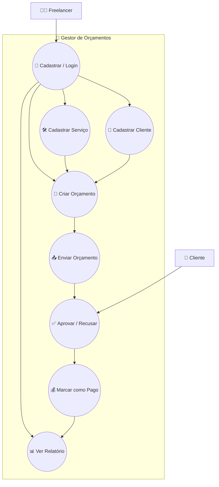

# 🗺️ Diagrama de Caso de Uso

## 📊 Diagrama Completo

## 🧠 Como ler

### 🟡 Atores
- *Freelancer* — usuário principal
- *Cliente* — ator secundário (aprova ou recusa)

### 🔵 Casos de Uso

| Código | Caso de Uso |
|--------|-------------|
| UC0 | 🔐 Cadastrar / Login |
| UC1 | 👥 Cadastrar Cliente |
| UC2 | 🛠️ Cadastrar Serviço |
| UC3 | 📝 Criar Orçamento |
| UC4 | 📤 Enviar Orçamento |
| UC5 | ✅ Aprovar / Recusar |
| UC6 | 💰 Marcar como Pago |
| UC7 | 📊 Ver Relatório |

### ➡️ Fluxo principal

Freelancer → Login → Cadastra Cliente/Serviço → Cria Orçamento → Envia
  → Cliente Aprova → Marca como Pago → Vê Relatório

### 📌 Regras de Negócio

1. *Login obrigatório* — todas as ações exigem autenticação
2. *Ordem de dependência* — criar orçamento exige pelo menos 1 cliente e 1 serviço
3. *Envio antes da aprovação* — o cliente só vê após receber
4. *Pagamento só após aprovação* — só se marca como pago o que foi aprovado
5. *Relatório consolida tudo* — aparece só com dados registrados